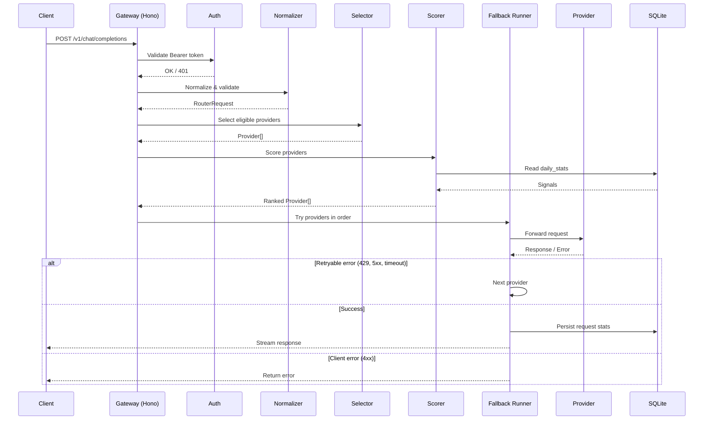

# OmniGate Architecture

## System Overview

OmniGate is a single-node, OpenAI-compatible proxy that routes chat completion requests to a pool of upstream LLM providers based on observed performance signals. It runs on Bun, uses Hono for HTTP, and persists routing statistics in SQLite.

```
┌─────────────┐     ┌──────────────┐     ┌─────────────────┐
│   Client    │────▶│   OmniGate   │────▶│  Provider Pool  │
│ (OpenAI SDK)│     │  (Port 8787) │     │  (Groq, etc.)   │
└─────────────┘     └──────┬───────┘     └────────┬────────┘
                           │                      │
                    ┌──────▼──────┐         ┌─────▼──────┐
                    │   SQLite    │◀───────▶│  Metrics   │
                    │  (Stats DB) │  observes│  (latency, │
                    └─────────────┘          │  errors,   │
                                             │  quota)    │
                                             └────────────┘
```

## Request Lifecycle

```
1. Client → POST /v1/chat/completions
2. Auth middleware validates Bearer token (timingSafeEqual)
3. Request normalizer:
   - Validates via Zod schema
   - Extracts model alias, mode, stream flag, reasoning_effort, stream_options
   - Normalizes `developer` roles to `system`
   - Sets defaults (mode: "balanced")
4. Provider Selector:
   - Resolves alias → families from registry
   - Filters providers by: family, enabled, api_key present, not in cooldown, supports required features (tools, JSON, streaming, reasoning)
5. Provider Scorer:
   - Reads per-provider signals from SQLite (daily_stats)
   - Computes weighted score per routing mode
   - Applies alias-level weight overrides
   - Tiebreaks by priority/speed/quality
6. Fallback Runner:
   - Iterates ranked providers
   - On 429/5xx/timeout/network error/malformed → try next
   - On other 4xx → stop, return error
   - On success → persist request stats, return response
7. Response streamed back to client (SSE passthrough)
```

## Core Components

### 1. Config Layer (`src/config/`)

- **config-loader.ts** — Reads `PORT`, `OMNIGATE_API_KEY`, `OMNIGATE_DB_PATH` from env. Validates port range, required secrets.
- **provider-loader.ts** — Parses `provider.registry.yaml` via Zod. Produces typed `Provider[]` and `AliasConfig` map.
- **provider.registry.yaml** — Single source of truth for providers, families, aliases, scores, feature flags, rate limits.

### 2. Routing Engine (`src/router/`)

| Module                  | Responsibility                                      |
| ----------------------- | --------------------------------------------------- |
| `provider-selector.ts`  | Alias→family resolution, eligibility filtering      |
| `provider-scorer.ts`    | Signal normalization, weighted scoring, tiebreaking |
| `fallback-runner.ts`    | Sequential provider trial with retry policy         |
| `provider-cooldown.ts`  | In-memory exponential backoff per provider          |
| `request-normalizer.ts` | Zod validation, defaults, mode parsing              |

**Scoring formula:**

```
score = Σ(weight_i × normalized_signal_i) + tiebreaker_bonus
```

**Signals (from `daily_stats`):**

- `throughput` = completion_tokens / total_latency
- `latency_json` = avg end-to-end ms
- `latency_stream` = avg TTFT ms
- `quality` = static registry score
- `reliability` = 1 - (failures + rate_limits) / total
- `quota_pressure` = daily_requests / rpd_limit

**Mode weights:**

| Mode     | speed | quality | reliability | throughput | quota |
| -------- | ----- | ------- | ----------- | ---------- | ----- |
| balanced | 1.0   | 1.0     | 1.0         | 1.0        | 1.0   |
| speed    | 3.0   | 0.5     | 0.5         | 2.0        | 0.5   |
| quality  | 0.5   | 3.0     | 1.0         | 0.5        | 0.5   |
| survival | 0.5   | 0.5     | 3.0         | 0.5        | 3.0   |

### 3. Provider Adapter (`src/provider/`)

- **provider-adapter.ts** — Interface: `chatComplete(request, providerConfig)`
- **openai-compatible-adapter.ts** — Implements OpenAI-compatible `/chat/completions` with streaming. Handles request/response transformation, error normalization.

### 4. Features (`src/feature/`)

| Feature         | Route                       | Auth | Description                  |
| --------------- | --------------------------- | ---- | ---------------------------- |
| Health          | `GET /health`               | No   | Liveness probe               |
| Models          | `GET /v1/models`            | Yes  | Lists aliases + capabilities |
| Chat Completion | `POST /v1/chat/completions` | Yes  | Main routing entrypoint      |

### 5. Storage (`src/storage/`)

- **sqlite.database.ts** — Bun SQLite wrapper, connection pooling, migrations
- **provider-stats.repository.ts** — CRUD for `providers`, `requests`, `daily_stats` tables

**Schema:**

```sql
providers (id, family, quality_score, speed_score, ...)
requests (id, provider_id, alias, mode, latency_ms, tokens, status, timestamp)
daily_stats (provider_id, date, requests, errors, rate_limits, total_latency, total_tokens)
```

### 6. Shared (`src/shared/`)

- **signatures.d.ts** — All TypeScript types (Provider, AliasConfig, RouterRequest, RoutingMode, etc.)
- **api-key-auth.ts** — Constant-time Bearer token validation
- **app-error.ts** — OpenAI-compatible error response format
- **result.ts** — `Result<T, E>` type for error handling without exceptions

## Data Flow Diagram



## Key Design Decisions

| Decision                   | Rationale                                                               |
| -------------------------- | ----------------------------------------------------------------------- |
| **Single-node SQLite**     | Zero ops, survives restarts, sufficient write throughput for metrics    |
| **No registry hot-reload** | Explicit restart avoids partial config states; simplicity > convenience |
| **OpenAI-compatible API**  | Drop-in for existing SDKs; `mode` as only extension                     |
| **Streaming passthrough**  | Zero memory overhead; true SSE compatibility                            |
| **Constant-time auth**     | Three lines of code; eliminates timing attack vector                    |
| **YAML registry**          | Human-readable, diffable, version-controllable                          |
| **Bun runtime**            | Native SQLite, no transpile, fast startup, built-in test runner         |

## Extensibility Points

1. **New provider** — Add to `provider.registry.yaml` + implement adapter if non-OpenAI-compatible
2. **New routing signal** — Add column to `daily_stats`, update scorer, add weight config
3. **New routing mode** — Add to `RoutingMode` enum, define weights in scorer
4. **New feature flag** — Add to provider schema, update selector filter logic
5. **Multi-node** — Swap SQLite repository for Redis-backed implementation (interface in `storage/`)

## Observability

- **Health**: `GET /health` → `{"status":"ok","service":"omnigate"}`
- **Models**: `GET /v1/models` → Lists active aliases with capabilities
- **Stats**: Query SQLite directly for per-provider latency, throughput, error rates
- **Logs**: Structured JSON via `console.log` (extendable to Pino/Winston)

## Failure Modes

| Scenario                             | Behavior                                   |
| ------------------------------------ | ------------------------------------------ |
| All providers in cooldown            | Returns 503 with retry-after               |
| No eligible providers for alias      | Returns 404                                |
| Upstream returns non-streaming error | Fallback to next provider                  |
| SQLite unavailable                   | Startup fails fast (no silent degradation) |
| Invalid registry YAML                | Startup fails with Zod validation error    |

## Future Architecture Considerations

- **Multi-node**: Redis-backed stats + distributed cooldown
- **Cost tracking**: Add `cost_per_token` to registry, aggregate in `daily_stats`
- **Prometheus metrics**: `/metrics` endpoint with provider-level gauges
- **Admin API**: Provider enable/disable, manual cooldown clear, stats reset
