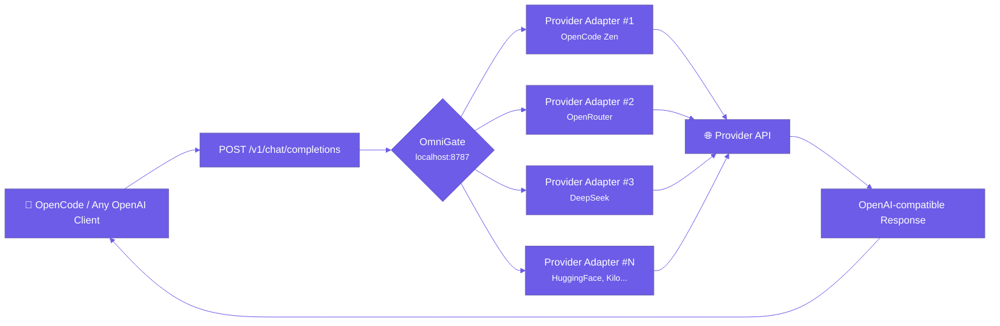
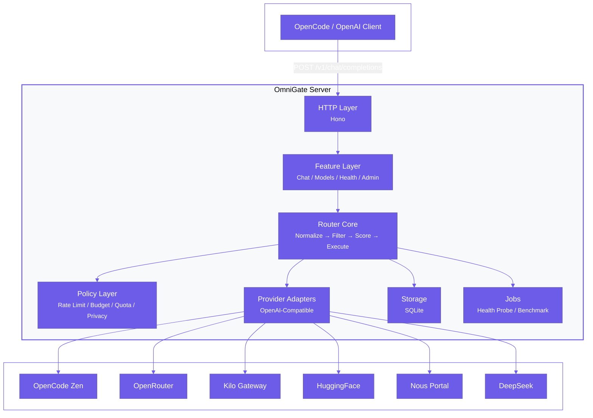
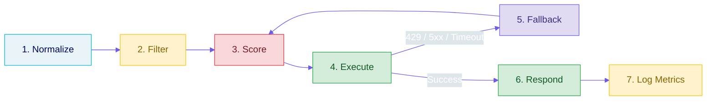
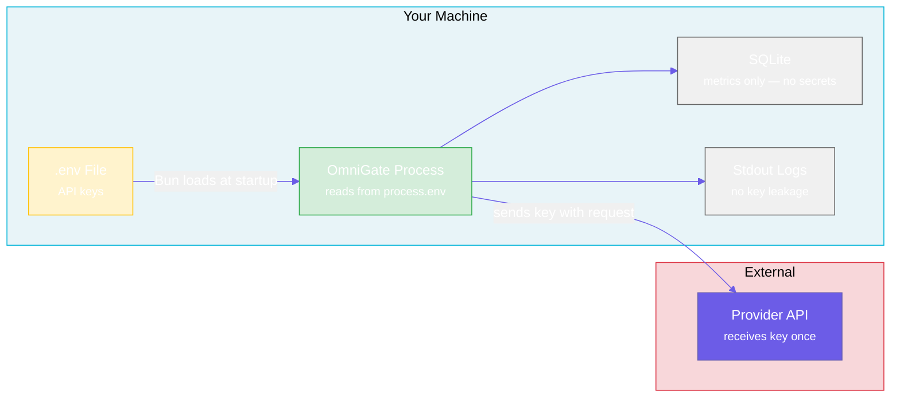

<p align="center">
  <picture>
    <source media="(prefers-color-scheme: dark)" srcset="https://img.shields.io/badge/OmniGate-self--hosted%20LLM%20gateway-6C5CE7?style=flat-square&labelColor=1a1a2e">
    
  </picture>
</p>

<p align="center">
  <a href="https://opensource.org/licenses/MIT"></a>
  <a href="https://bun.sh"></a>
  <a href="https://www.typescriptlang.org/"></a>
  <a href="https://hono.dev"></a>
  <br>
  <a href="https://github.com/raindragon14/omnigate/actions"></a>
  <a href="https://github.com/raindragon14/omnigate"></a>
  <a href="#security-model"></a>
  <a href="https://github.com/raindragon14/omnigate/pkgs/container/omnigate"></a>
</p>

---

**OmniGate** is a self-hosted, open-source LLM gateway that unifies every AI provider behind a single OpenAI-compatible endpoint. It runs on your machine, uses your API keys, and intelligently routes each request to the best available provider.

```bash
curl http://localhost:8787/v1/chat/completions \
  -H "Content-Type: application/json" \
  -d '{
    "model": "omnigate/deepseek-v4-flash-auto",
    "messages": [{"role": "user", "content": "Write a fast sorting algorithm in Rust"}]
  }'
```

```json
{
  "id": "chatcmpl-abc123",
  "object": "chat.completion",
  "model": "deepseek-v4-flash",
  "choices": [
    {
      "index": 0,
      "message": {
        "role": "assistant",
        "content": "// Quicksort implementation in Rust..."
      }
    }
  ]
}
```

## Table of Contents

- [Why OmniGate?](#why-omnigate)
- [Architecture](#architecture)
- [Routing Pipeline](#routing-pipeline)
- [Docker Deployment](#docker-deployment-vps)
- [Quick Start (Local)](#quick-start-local)
- [Model Aliases](#model-aliases)
- [Routing Modes](#routing-modes)
- [API Reference](#api-reference)
- [Supported Providers](#supported-providers)
- [Security Model](#security-model)
- [Project Status](#project-status)
- [Scripts](#scripts)
- [License](#license)

## Why OmniGate?

Every LLM provider has its own API, rate limits, pricing, and quirks. Juggling them manually is brittle. OmniGate sits **on your machine** and acts as a transparent middleware — giving you one API, unlimited fallback options, and zero vendor lock-in.



### Key Features

| | |
|---|---|
| **🔒 Zero-Trust Security** | Your API keys stay in `.env` on your machine. OmniGate never stores, logs, or sends them anywhere except to the provider you choose. |
| **🧠 Smart Routing** | Scores providers by quality, latency, quota, availability, throughput, and feature match. Picks the best one per request. |
| **🔄 Automatic Fallback** | 429, 5xx, or timeout? Silently retries the next-best provider. No failed requests. |
| **📊 Quota-Aware** | Tracks your remaining free tier across all providers. Routes to the one with the most runway. |
| **🛡️ Privacy Mode** | Strict mode blocks sensitive prompts from reaching free/trial providers that may use data for training. |
| **💰 Cost Guardrails** | Paid fallback is off by default. When enabled, a hard monthly cap prevents bill shock. |
| **📡 Streaming** | SSE streaming normalized to OpenAI-compatible format. |

## Architecture



## Routing Pipeline

Every request goes through five stages:



| Stage | What happens |
|-------|-------------|
| **Normalize** | OpenAI-compatible request → internal `RouterRequest`. Drops unsupported fields. |
| **Filter** | Removes disabled, keyless, cooldown, exhausted, over-budget, or feature-incompatible providers. |
| **Score** | Ranks remaining candidates using a weighted formula of quality, latency, throughput, quota, and feature match. |
| **Execute** | Sends request through the highest-ranked adapter. |
| **Fallback** | On failure (429, 5xx, timeout), selects the next best candidate and retries. |
| **Respond** | Returns OpenAI-compatible response (or normalized error if all providers fail). |
| **Log Metrics** | Persists latency, tokens, cost, status, and selected provider to SQLite. |

### Scoring Formula

```
score = 0.30 × qualityScore
      + 0.20 × availabilityScore
      + 0.15 × throughputScore
      + 0.15 × latencyScore
      + 0.10 × quotaRemainingScore
      + 0.10 × featureMatchScore
      - penalties
```

| Penalty | Value |
|---------|------:|
| Recent 429 | -40 |
| Recent 5xx | -25 |
| Timeout | -30 |
| Privacy risk | -10 to -30 |
| Feature mismatch | Rejected |

## Docker Deployment (VPS)

Deploy OmniGate on any VPS with Docker in under a minute:

```bash
curl -fsSL https://raw.githubusercontent.com/raindragon14/omnigate/main/deploy.sh | bash
```

Or step by step:

```bash
git clone https://github.com/raindragon14/omnigate
cd omnigate

# Configure your API keys
cp .env.example .env
# Edit .env and paste your keys

# Build and start
docker compose up -d --build
```

The server starts on `http://<your-vps-ip>:8787`.

| Command | What it does |
|---------|-------------|
| `docker compose up -d --build` | Build and start in background |
| `docker compose logs -f` | Follow logs |
| `docker compose down` | Stop |
| `git pull && docker compose up -d --build` | Update to latest |

### Image Registry

Pre-built images are available on GitHub Container Registry:

```bash
docker pull ghcr.io/raindragon14/omnigate:latest

docker run -d \
  --name omnigate \
  -p 8787:8787 \
  --env-file .env \
  -v omnigate_data:/app/data \
  ghcr.io/raindragon14/omnigate:latest
```

Tags: `latest` (main branch), `1.0.0` (semver releases), `sha-<abc1234>` (every commit).

## Quick Start (Local)

**Prerequisites:** [Bun](https://bun.sh) 1.3.14+

```bash
# Clone the repo
git clone https://github.com/raindragon14/omnigate
cd omnigate

# Install dependencies
bun install

# Set up your environment
cp .env.example .env

# Edit .env with your API keys
#   OPENCODE_API_KEY=sk-...
#   OPENROUTER_API_KEY=sk-...
#   DEEPSEEK_API_KEY=sk-...

# Start the server
bun run dev
```

The server starts on `http://localhost:8787`.

### Verify It Works

```bash
# Health check
curl http://localhost:8787/health

# List available models
curl http://localhost:8787/v1/models
```

### OpenCode Integration

Add to your OpenCode config:

```json
{
  "model": "omnigate/deepseek-v4-flash-auto",
  "provider": {
    "omnigate": {
      "name": "OmniGate",
      "options": { "baseURL": "http://localhost:8787/v1" }
    }
  }
}
```

## Model Aliases

OmniGate exposes stable aliases that abstract away provider-specific model names:

| Alias | Routes to |
|-------|-----------|
| `omnigate/deepseek-v4-flash-auto` | DeepSeek V4 Flash via best available free provider |
| `omnigate/mimo-v2.5-auto` | MiMo V2.5 via best available free provider |
| `omnigate/coding-balanced` | Best all-rounder coding model |
| `omnigate/coding-fast` | Lowest-latency coding model |
| `omnigate/emergency-paid` | Paid fallback (off by default; configure a budget) |

## Routing Modes

Override the scoring bias by passing `mode` in your request body:

| Mode | Behavior | Best for |
|------|----------|----------|
| `balanced` | Default — equal weighting across all dimensions | Everyday use |
| `quality` | Biases heavily toward quality score | Complex reasoning, code generation |
| `speed` | Prioritizes low TTFT and high tokens/sec | Real-time chat, autocomplete |
| `survival` | Biases toward remaining quota, avoids paid | Stretching limited free tier |

## API Reference

| Method | Path | Description |
|--------|------|-------------|
| `GET` | `/health` | Server health check |
| `GET` | `/v1/models` | List available model aliases |
| `POST` | `/v1/chat/completions` | Chat completion (OpenAI-compatible) |
| `GET` | `/admin/providers` | Provider status, cooldowns, enabled state |
| `GET` | `/admin/metrics` | Latency, error rate, token usage, cost summary |

## Supported Providers

| Provider | Access | Cost Model | Est. Rate Limits | Priority |
|----------|--------|------------|-----------------|---------:|
| OpenCode Zen | API key | Free (limited period) | 5-10 RPM | 100 |
| OpenCode Zen (MiMo) | API key | Free (limited period) | 5-10 RPM | 98 |
| OpenRouter | API key | Free | ~20 RPM, RPD varies | 90 |
| Kilo Gateway | API key | Free (verified account) | ~200 RPH | 85 |
| Hugging Face | HF Token | Small monthly credit | Conservative | 70 |
| Nous Portal | API key | Free (manual verify) | Unknown | 60 |
| DeepSeek (paid) | API key | $0.14/$0.28 per 1M tokens | Standard | 40 |

## Security Model



| Concern | How OmniGate handles it |
|---------|------------------------|
| **API keys** | Read from `process.env` only. Never logged, never stored in SQLite, never sent to any OmniGate server (there is none). |
| **Prompt data** | Stays in memory during request processing. Never sent to a third-party server except the intended provider. |
| **Telemetry** | Zero. No analytics, no crash reporting, no phone-home. The project has no backend. |
| **Database** | Local SQLite file contains usage metrics and provider state only — never API keys or prompt content. |
| **Updates** | You control when and whether to update. No forced upgrades or auto-update mechanisms. |
| **Auditability** | MIT license. You can read every line of code. No obfuscation, no binary blobs. |

> **The bottom line:** OmniGate cannot leak your keys because it never has them. They exist in your `.env`, loaded by your Bun process, sent directly to your chosen provider. There is no SaaS backend, no telemetry endpoint, no third-party service that could be compromised.

## Project Status

```
MVP Phase — Core routing scaffold in place, provider adapters in progress
```

| Feature | Status |
|---------|--------|
| HTTP server with Hono | ✅ Complete |
| `GET /health` | ✅ Complete |
| `GET /v1/models` with aliases | ✅ Complete |
| OpenAI-compatible error shapes | ✅ Complete |
| Config loader with port validation | ✅ Complete |
| Provider registry schema (YAML) | ✅ Complete |
| Test infrastructure (unit + integration) | ✅ Complete |
| `POST /v1/chat/completions` | 🔄 In progress |
| Provider adapters & fallback | 🔄 In progress |
| Rate limiting & cooldown | 🔄 In progress |
| SQLite persistence | 🔄 In progress |
| Privacy mode (strict) | 📋 Planned |
| Streaming support | 📋 Planned |
| Admin endpoints | 📋 Planned |
| Health probes & EWMA scoring | 📋 Planned |

## Scripts

| Command | Description |
|---------|-------------|
| `bun run dev` | Start development server with file watching |
| `bun test` | Run all tests |
| `bun run test:feature` | Run feature-level tests (unit + collocated integration) |
| `bun run test:integration` | Run cross-feature integration tests |
| `bun run typecheck` | Type-check the entire codebase |

## Architecture Reference

```
src/
├── server.ts                 # Bun HTTP entrypoint
├── app.ts                    # Hono app composition
├── feature/                  # Feature-driven modules
│   ├── health/               # GET /health
│   ├── model/                # GET /v1/models
│   ├── chat-completion/      # POST /v1/chat/completions
│   └── admin/                # Admin dashboard
├── router/                   # Core routing engine
│   ├── request-normalizer.ts
│   ├── provider-selector.ts
│   ├── provider-scorer.ts
│   └── fallback-runner.ts
├── provider/                 # Provider adapters
│   ├── provider-adapter.ts   # Adapter contract
│   ├── openai-compatible-adapter.ts
│   └── {provider}.adapter.ts
├── policy/                   # Rate-limit, budget, quota, privacy
├── storage/                  # SQLite repositories
├── job/                      # Health probes & benchmarks
├── config/                   # Config loader & YAML registry
└── shared/                   # Common utilities & types
```

## Contributing

OmniGate is in active development. Contributions are welcome — see the [Sprint Breakdown](docs/SPRINT_BREAKDOWN.md) for current priorities.

### Development Principles

- **Feature-driven architecture** — each capability owns its routes, services, schemas, and tests.
- **25-line functions, 300-line files** — keep cognitive load low.
- **No magic numbers or strings** — every threshold, status code, and header is a named constant.
- **Signature manifest** — public types live in `docs/codebase-signatures.d.ts`. Update it when adding new reusable contracts.

## License

[MIT](LICENSE) © OmniGate Contributors

---

<p align="center">
  <em>OmniGate is free, open-source, and self-hosted.<br>
  You control your keys, your data, and your infrastructure.<br>
  No cloud. No vendor lock-in. No compromises.</em>
</p>
