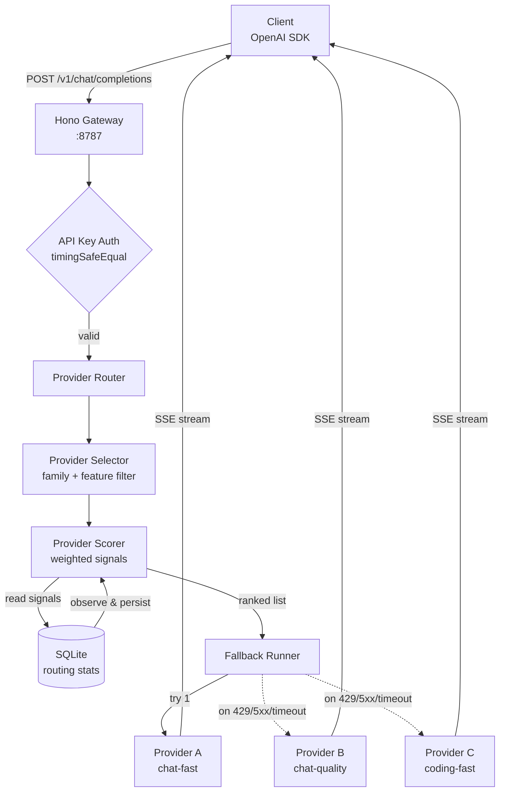

# OmniGate

[](LICENSE)
[](https://bun.sh)
[](https://github.com/raindragon14/omnigate/actions)
[](https://github.com/raindragon14/omnigate/pkgs/container/omnigate)

**A local OpenAI-compatible endpoint that pools free LLM providers behind a single base URL, with automatic fallback and performance-based routing.**

---

## Table of Contents

- [Overview](#overview)
- [Quick Start](#quick-start)
- [Architecture](#architecture)
- [How It Works](#how-it-works)
- [Usage](#usage-openai-sdk)
- [Configuration](#configuration)
- [Technical Decisions](#technical-decisions)
- [Roadmap](#roadmap)
- [Development](#development)
- [Contributing](#contributing)
- [License](#license)

---

## Overview

OmniGate consolidates several free-tier LLM providers (Groq, Together, Fireworks, and others) behind one OpenAI-compatible endpoint. Each provider has its own rate limits, model names, and failure modes; managing them individually means reacting to 429 responses and switching providers by hand.

OmniGate treats providers as a pool rather than a fixed choice. Every request produces signals — latency, throughput, error rate, quota consumption — which are recorded in SQLite. Each new request is routed to the provider currently performing best for that request profile, so routing accuracy improves with use.

The result is a single `baseURL` and a single API key.

---

## Quick Start

### Docker (recommended)

```bash
curl -fsSL https://raw.githubusercontent.com/raindragon14/omnigate/main/deploy.sh | bash
```

This generates an `OMNIGATE_API_KEY`, installs a systemd service, and starts the gateway on `127.0.0.1:8787`.

### Local

```bash
git clone https://github.com/raindragon14/omnigate && cd omnigate
cp .env.example .env
# Set OMNIGATE_API_KEY and at least one provider key (PROVIDER_A_API_KEY, etc.)
bun install
bun run dev
```

Verify the installation:

```bash
curl http://localhost:8787/health
# {"status":"ok","service":"omnigate"}
```

---

## Architecture


```mermaid
flowchart TD
    Client[Client<br/>OpenAI SDK] -->|POST /v1/chat/completions| Gateway[Hono Gateway<br/>:8787]
    Gateway --> Auth{API Key Auth<br/>timingSafeEqual}
    Auth -->|valid| Router[Provider Router]
    Router --> Selector[Provider Selector<br/>family + feature filter]
    Selector --> Scorer[Provider Scorer<br/>weighted signals]
    Scorer -->|read signals| SQLite[(SQLite<br/>routing stats)]
    Scorer -->|ranked list| Fallback[Fallback Runner]
    Fallback -->|try 1| ProviderA[Provider A<br/>chat-fast]
    Fallback -.->|on 429/5xx/timeout| ProviderB[Provider B<br/>chat-quality]
    Fallback -.->|on 429/5xx/timeout| ProviderC[Provider C<br/>coding-fast]
    ProviderA -->|SSE stream| Client
    ProviderB -->|SSE stream| Client
    ProviderC -->|SSE stream| Client
    SQLite -->|observe & persist| Scorer
```

**Request flow:** authenticate → match alias to provider families → filter by features, API key availability, and cooldown → score by weighted signals → attempt the highest-ranked provider → fall back on retryable errors → return the first successful response.

---

## How It Works

**Signals tracked per provider:**

- **Throughput** — completion tokens divided by total latency
- **Latency** — end-to-end for JSON responses, time to first token for streaming
- **Quality** — static score from the registry (0–100)
- **Reliability** — 1 − (failures + rate limits) / total requests
- **Quota pressure** — daily requests divided by the daily limit
- **Feature match** — tools, JSON mode, streaming, reasoning effort (hard filter)

**Routing modes** (set `mode` in the request body):

| Mode       | Bias                                        |
| ---------- | ------------------------------------------- |
| `balanced` | Equal weights (default)                     |
| `speed`    | 3× latency/throughput, 0.5× quality         |
| `quality`  | 3× quality, 0.5× speed                      |
| `survival` | 3× reliability/quota, avoids paid fallbacks |

Alias-level overrides are defined in `src/config/provider.registry.yaml`; see `omnigate/coding-fast` for an example.

**Fallback** is triggered by 429, 5xx, timeout, network errors, and malformed responses. Routing stops on other 4xx client errors. **Cooldown** uses exponential backoff and is persisted in SQLite.

---

## Usage (OpenAI SDK)

```typescript
import OpenAI from "openai";

const openai = new OpenAI({
  baseURL: "http://localhost:8787/v1",
  apiKey: process.env.OMNIGATE_API_KEY,
});

// Basic request
const completion = await openai.chat.completions.create({
  model: "omnigate/auto-fast",
  messages: [{ role: "user", content: "Explain quantum entanglement" }],
});

// Streaming
for await (const chunk of await openai.chat.completions.create({
  model: "omnigate/auto-quality",
  messages: [{ role: "user", content: "Write a short story" }],
  stream: true,
})) {
  process.stdout.write(chunk.choices[0]?.delta?.content ?? "");
}

// Mode override
await openai.chat.completions.create({
  model: "omnigate/coding-fast",
  messages: [{ role: "user", content: "Refactor this function" }],
  mode: "speed",
});
```

**Additional request fields:**

- `reasoning_effort` (`minimal` | `low` | `medium` | `high`) — forwarded upstream only to providers with `supports_reasoning: true`. Providers without the flag are excluded from routing for that request (hard filter, as with tools).
- `stream_options: { include_usage: true }` — forwarded on streaming requests so the upstream returns the usage chunk.
- `role: "developer"` messages are accepted and normalized to `system` before routing.
- `max_tokens` is sent using each provider's `max_tokens_field` (`max_tokens` by default, or `max_completion_tokens` when configured in the registry).

---

## Configuration

### Environment Variables

| Variable             | Required     | Default                 | Notes                           |
| -------------------- | ------------ | ----------------------- | ------------------------------- |
| `OMNIGATE_API_KEY`   | Yes          | —                       | Client auth token               |
| `PORT`               | No           | `8787`                  | HTTP port                       |
| `OMNIGATE_DB_PATH`   | No           | `.data/omnigate.sqlite` | SQLite file                     |
| `PROVIDER_*_API_KEY` | Per provider | —                       | Match `api_key_env` in registry |

### Provider Registry

Providers are configured in `src/config/provider.registry.yaml`:

```yaml
providers:
  - id: groq_llama3
    base_url: "https://api.groq.com/openai/v1"
    model: "llama-3.3-70b-versatile"
    api_key_env: "GROQ_API_KEY"
    family: "chat-fast"
    priority: 90
    quality_score: 85
    speed_score: 95
    enabled: true
    supports_tools: true
    supports_json: true
    supports_streaming: true
    supports_reasoning: true
    # max_tokens_field: max_completion_tokens   # optional upstream body key
    rate_limit:
      rpm: 30
```

**Aliases** (the model names clients request):

```yaml
aliases:
  omnigate/auto-fast:
    families: ["chat-fast", "chat-balanced"]
  omnigate/coding-fast:
    families: ["coding-fast"]
    weights:
      speed: 5
      quality: 0.5
    tiebreak: speed
```

To add a provider, add its `api_key_env` to `.env` and restart the service.

---

## Technical Decisions

**Bun over Node/Deno** — Native SQLite access, no transpile step, a built-in test runner, and fast cold starts. The `bun:sqlite` API handles the write-heavy stats workload without additional dependencies.

**Hono** — Small dependency footprint (~14 KB) with accurate TypeScript inference. Express would add unnecessary weight; Fastify adds complexity that is not required here.

**SQLite (`bun:sqlite`)** — A single-file database that survives restarts and needs no configuration. The current write volume is well within SQLite's limits; clustering is not required yet.

**YAML registry** — Human-editable and diff-friendly, and changes require no recompilation. Hot reload is deliberately omitted: an explicit restart is safer and easier to reason about in production.

**OpenAI-compatible API** — Drop-in compatibility with any OpenAI SDK client. The `mode` parameter is the only extension to the standard schema.

**Constant-time auth** — Bearer tokens are compared with `timingSafeEqual`, which removes a timing side channel at negligible cost.

**Streaming passthrough** — SSE bytes are forwarded without buffering or transformation, so memory use stays flat regardless of response size.

**No registry hot-reload** — File watchers introduce complexity and new failure modes. Restart is explicit and observable. Hot reload will be added when there is a concrete need for it.

---

## Roadmap

- Multi-node deployment (Redis-backed stats); single instance only for now
- Cost tracking per provider and request
- Prometheus `/metrics` endpoint
- Admin dashboard
- Opt-in request/response logging

These are deliberate omissions rather than oversights: the core routing loop is stable, and further work will be driven by demand.

---

## Development

```bash
bun install
bun run dev          # Watch mode
bun test             # Unit and integration tests
bun run typecheck    # Strict TypeScript
bun x prettier --write .
```

CI runs `typecheck` followed by `test` on every push.

---

## Contributing

See [CONTRIBUTING.md](CONTRIBUTING.md).

---

## License

MIT. See [LICENSE](LICENSE).

---

Maintained by [raindragon14](https://github.com/raindragon14). Issues and pull requests are welcome.
