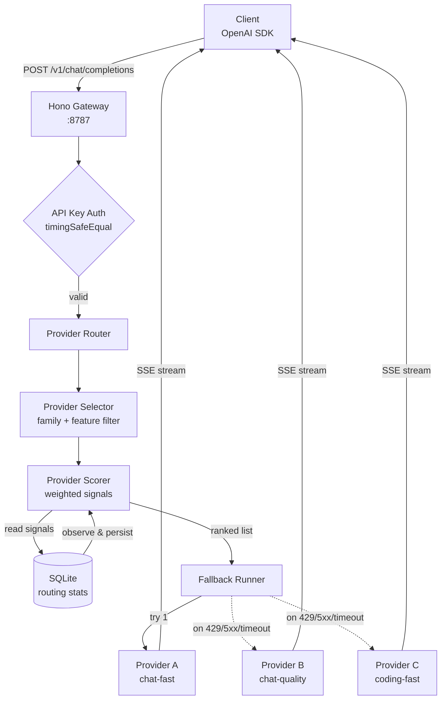

# OmniGate

[](LICENSE)
[](https://bun.sh)
[](https://github.com/raindragon14/omnigate/actions)
[](https://github.com/raindragon14/omnigate/pkgs/container/omnigate)

**One local OpenAI-compatible endpoint that pools free LLM providers behind a single base URL with automatic fallback and intelligent routing.**

---

## Table of Contents

- [Why This Exists](#why-this-exists)
- [Quick Start](#quick-start)
- [How It Works](#how-it-works)
- [Usage](#usage-openai-sdk)
- [Configuration](#configuration)
- [Technical Decisions](#technical-decisions-and-why)
- [What's Not Done Yet](#whats-not-done-yet)
- [Development](#development)
- [Contributing](#contributing)
- [License](#license)

---

## Why This Exists

I got tired of juggling API keys. Groq for speed, Together for quality, Fireworks for coding — each with different rate limits, different model names, different failure modes. I'd switch manually when one hit a 429, which meant I was always reacting, never ahead.

The insight: **treat providers as a pool, not a pick**. Every request generates signal — latency, throughput, error rate, quota burn. Store that in SQLite. Next request, route to the provider that's _actually_ performing best _right now_ for _that kind of request_. The system gets smarter the more you use it.

Result: one `baseURL`, one API key. It just works, and it gets faster over time.

---

## Quick Start

### Docker (easiest)

```bash
curl -fsSL https://raw.githubusercontent.com/raindragon14/omnigate/main/deploy.sh | bash
```

Generates your `OMNIGATE_API_KEY`, sets up a systemd service, runs on `127.0.0.1:8787`.

### Local

```bash
git clone https://github.com/raindragon14/omnigate && cd omnigate
cp .env.example .env
# Add OMNIGATE_API_KEY + at least one provider key (PROVIDER_A_API_KEY, etc.)
bun install
bun run dev
```

Test it:

```bash
curl http://localhost:8787/health
# {"status":"ok","service":"omnigate"}
```

---

## Architecture


```mermaid
flowchart TD
    Client[Client<br/>OpenAI SDK] -->|POST /v1/chat/completions| Gateway[Hono Gateway<br/>:8787]
    Gateway --> Auth{API Key Auth<br/>timingSafeEqual}
    Auth -->|valid| Router[Provider Router]
    Router --> Selector[Provider Selector<br/>family + feature filter]
    Selector --> Scorer[Provider Scorer<br/>weighted signals]
    Scorer -->|read signals| SQLite[(SQLite<br/>routing stats)]
    Scorer -->|ranked list| Fallback[Fallback Runner]
    Fallback -->|try 1| ProviderA[Provider A<br/>chat-fast]
    Fallback -.->|on 429/5xx/timeout| ProviderB[Provider B<br/>chat-quality]
    Fallback -.->|on 429/5xx/timeout| ProviderC[Provider C<br/>coding-fast]
    ProviderA -->|SSE stream| Client
    ProviderB -->|SSE stream| Client
    ProviderC -->|SSE stream| Client
    SQLite -->|observe & persist| Scorer
```

**Request flow**: Authenticate → Match alias to families → Filter by features/API key/cooldown → Score by weighted signals → Try top provider → Fallback on retryable errors → Return first success.

---

## How It Works

**Signals we track per provider:**

- **Throughput** — completion tokens / total latency
- **Latency** — end-to-end (JSON) or TTFT (streaming)
- **Quality** — static score from registry (0–100)
- **Reliability** — 1 − (failures + rate_limits) / total_requests
- **Quota pressure** — daily_requests / rpd_limit
- **Feature match** — tools, JSON mode, streaming, reasoning effort (hard filter)

**Routing modes** (pass `mode` in request body):

| Mode       | Bias                                        |
| ---------- | ------------------------------------------- |
| `balanced` | Equal weights (default)                     |
| `speed`    | 3× latency/throughput, 0.5× quality         |
| `quality`  | 3× quality, 0.5× speed                      |
| `survival` | 3× reliability/quota, avoids paid fallbacks |

Alias-level overrides live in `provider.registry.yaml` — see `omnigate/coding-fast` for an example.

**Fallback triggers:** 429, 5xx, timeout, network error, malformed response.  
**Stops on:** other 4xx (client errors).  
**Cooldown:** exponential backoff, persisted in SQLite.

---

## Usage (OpenAI SDK)

```typescript
import OpenAI from "openai";

const openai = new OpenAI({
  baseURL: "http://localhost:8787/v1",
  apiKey: process.env.OMNIGATE_API_KEY,
});

// Basic
const completion = await openai.chat.completions.create({
  model: "omnigate/auto-fast",
  messages: [{ role: "user", content: "Explain quantum entanglement" }],
});

// Streaming
for await (const chunk of await openai.chat.completions.create({
  model: "omnigate/auto-quality",
  messages: [{ role: "user", content: "Write a short story" }],
  stream: true,
})) {
  process.stdout.write(chunk.choices[0]?.delta?.content ?? "");
}

// Mode override
await openai.chat.completions.create({
  model: "omnigate/coding-fast",
  messages: [{ role: "user", content: "Refactor this function" }],
  mode: "speed",
});
```

**Extra request fields:**

- `reasoning_effort` (`minimal` | `low` | `medium` | `high`) — forwarded upstream only to providers with `supports_reasoning: true`; providers without the flag are excluded from routing for that request (hard filter, like tools).
- `stream_options: { include_usage: true }` — forwarded on streaming requests so upstream returns the usage chunk.
- `role: "developer"` messages are accepted and normalized to `system` before routing.
- `max_tokens` is sent using each provider's `max_tokens_field` (`max_tokens` by default, or `max_completion_tokens` when configured in the registry).

---

## Configuration

### Environment Variables

| Variable             | Required     | Default                 | Notes                           |
| -------------------- | ------------ | ----------------------- | ------------------------------- |
| `OMNIGATE_API_KEY`   | Yes          | —                       | Client auth token               |
| `PORT`               | No           | `8787`                  | HTTP port                       |
| `OMNIGATE_DB_PATH`   | No           | `.data/omnigate.sqlite` | SQLite file                     |
| `PROVIDER_*_API_KEY` | Per provider | —                       | Match `api_key_env` in registry |

### Provider Registry

Edit `src/config/provider.registry.yaml`. Example entry:

```yaml
providers:
  - id: groq_llama3
    base_url: "https://api.groq.com/openai/v1"
    model: "llama-3.3-70b-versatile"
    api_key_env: "GROQ_API_KEY"
    family: "chat-fast"
    priority: 90
    quality_score: 85
    speed_score: 95
    enabled: true
    supports_tools: true
    supports_json: true
    supports_streaming: true
    supports_reasoning: true
    # max_tokens_field: max_completion_tokens   # optional upstream body key
    rate_limit:
      rpm: 30
```

**Aliases** (what clients actually call):

```yaml
aliases:
  omnigate/auto-fast:
    families: ["chat-fast", "chat-balanced"]
  omnigate/coding-fast:
    families: ["coding-fast"]
    weights:
      speed: 5
      quality: 0.5
    tiebreak: speed
```

Add a provider → add its `api_key_env` to `.env` → restart. That's it.

---

## Technical Decisions (And Why)

**Bun over Node/Deno** — Native SQLite, no transpile step, built-in test runner, fast cold starts. The `bun:sqlite` API is clean and fast enough for our write-heavy stats workload.

**Hono** — Zero deps, ~14KB, edge-ready, TypeScript inference that actually works. Express would've been fine but heavier; Fastify adds complexity we don't need.

**SQLite (`bun:sqlite`)** — Not Postgres, not Redis. Single file, survives restarts, zero config, handles our write volume easily. We're not clustering yet.

**YAML registry** — Not JSON, not TypeScript config. Human-editable, diffs cleanly in PRs, no recompile needed. Hot-reload would be nice but explicit restart is safer for production.

**OpenAI-compatible API** — Not a custom schema. Drop-in for any OpenAI SDK client. Zero learning curve. The `mode` parameter is our only extension.

**Constant-time auth** — `timingSafeEqual` on the Bearer token. Paranoid? Maybe. But it's three lines of code and eliminates a timing attack vector.

**Streaming passthrough** — No buffering, no transformation. SSE bytes flow straight through. Memory stays flat regardless of response size.

**No registry hot-reload** — File watchers add complexity and failure modes. Restart is explicit, visible, and safe. We'll add it when someone actually needs it.

---

## What's Not Done Yet

- Multi-node (Redis-backed stats) — single instance only for now
- Cost tracking per provider/request
- Prometheus `/metrics` endpoint
- Admin dashboard
- Request/response logging (opt-in)

These are intentional omissions, not oversights. The core routing loop is solid. Everything else waits for real demand.

---

## Development

```bash
bun install
bun run dev          # Watch mode
bun test             # Unit + integration (132 tests)
bun run typecheck    # Strict TS
bun x prettier --write .
```

CI runs `typecheck` → `test` on every push.

---

## Contributing

See [CONTRIBUTING.md](CONTRIBUTING.md).

---

## License

MIT. See `LICENSE`.

---

Built by [raindragon14](https://github.com/raindragon14). Issues and PRs welcome.
